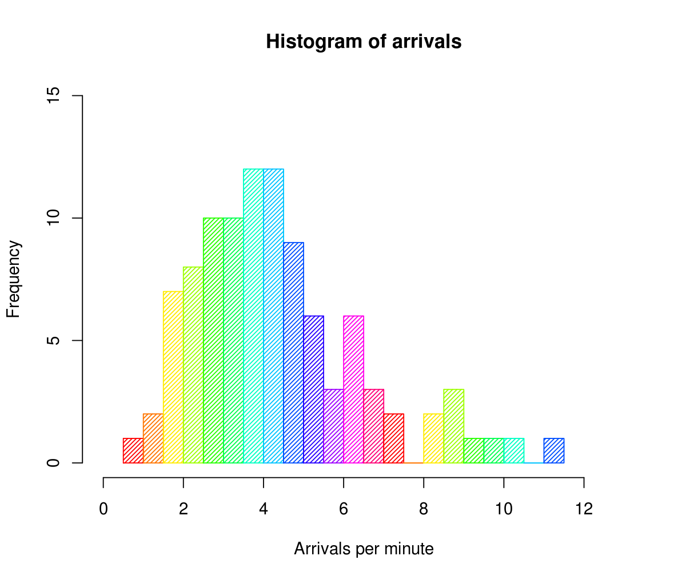

```{r setup, include=FALSE}
knitr::opts_chunk$set(echo = TRUE)
```

#Contents


This is an R Markdown document consisting basic methods oF *data analysis, stastical inFerence, data visualization* and some other inbuilt Function oF R.
A large part oF the data and methods used in this document were taken From Foundation OF Data Analysis part-I From **edx** <https://courses.edx.org/courses/course-v1:UTAustinX+UT.7.11x+2T2017/course/>

#UniVariate Data:
Univariate means "one variable" (one type oF data)
Example: You weigh the pups and get these results:
1,3,4,6,8,10,12
The one variable is Puppy Weight

```{r }
pups=c(1,3,3,3,3,4,6,6,6,7,8,10,10)
```


##Measure OF Center In Univariate Data
* Mean:The arithmetic mean is the central value oF a discrete set oF numbers: speciFically, the sum oF the values divided by the number oF values.
$$ \frac{\sum X}{n} $$


For our puppy weights data set mean is:
```{r}
mean(pups)
```

*Median:The median is the value separating the higher halF From the lower halF oF a data sample. For a data set, it may be thought oF as the "middle" value.
```{r a2, echo=FALSE, Fig.cap="A caption", out.width = '50%'}
knitr::include_graphics("medi.png")
```
For our puppy weights data set median is:
```{r}
median(pups)
```
*Mode:The mode oF a set oF data values is the value that appears most oFten.
For our puppy weights data set mode is:
```{r}
mode(pups)
```


***
```{r a3, echo=FALSE, Fig.cap="A caption", out.width = '50%'}

```
***


#Data Visualization:
###Numerical Univariate DATA:
** 1. Histogram**:A histogram is a diagram consisting of rectangles whose area is proportional to the frequency of a variable and whose width is equal to the class interval.
In R histogram can be create like shown below:
```{r}
hist(pups)
```

```{r , echo=FALSE, Fig.cap="A caption", out.width = '50%'}

```


**2.Dot Plot**:A dot chart or dot plot is a statistical chart consisting of data points plotted on a fairly simple scale, typically using filled in circles.
Dot plot in R can be obtained by dotchart()
```{r}
dotchart(pups)
```

**3.Stem and Leaf Plot**:A Stem and Leaf Plot is a special table where each data value is split into a "stem" (the first digit or digits) and a "leaf" (usually the last digit). Like in this example:
```{r  , echo=FALSE, Fig.cap="A caption", out.width = '50%'}

```


**4.Box and Whisker Plot**:A box and whisker plot is a very convenient and informative way to diplay the info captured in the five number summary. A box and whisker plot shows the centers and spread of the values on a single quantative variable.

```{r , echo=FALSE, Fig.cap="A caption", out.width = '50%'}

```

###Categorical Data:
**1.Bar Plot**:A bar chart or bar graph is a chart or graph that presents categorical data with rectangular bars with heights or lengths proportional to the values that they represent. The bars can be plotted vertically or horizontally. A vertical bar chart is sometimes called a line graph. 

```{r}
colors=c('red','green','blue','yellow')
freq=c(5,10,15,3)
barplot(freq,col = c('red','green','blue','yellow'))

```

**2.Pie plot**:A pie chart (or a circle chart) is a circular statistical graphic, which is divided into slices to illustrate numerical proportion. In a pie chart, the arc length of each slice (and consequently its central angle and area), is proportional to the quantity it represents.
```{r}
pie(freq,col = c('red','green','blue','yellow'))
```

###Bivariate Data:
**1.Scatterp Plot**:A scatter plot (also called a scatterplot) is a type of plot or mathematical diagram using Cartesian coordinates to display values for typically two variables for a set of data

```{r}
years=(2001:2009)
popin1000s=3^(years-min(years))
plot(years,popin1000s)
```

## Shapes OF Distribuitions:
**1.Symmetric(Bell shaped)**: Unimode. Occurs in normal distributions. - when graphed, a vertical line drawn at the center will Form mirror images, with the leFt halF oF the graph being the mirror image oF the right halF oF the graph.
```{r  , echo=FALSE, Fig.cap="A caption", out.width = '50%'}

```


**2.UniForm**: The data is spread equally across the range.
```{r  , echo=FALSE, Fig.cap="A caption", out.width = '50%'}

```


**3.Right Skewed**(positively skewed): Fewer data plots are Found to the right oF the graph (toward the larger numeric values).
```{r, echo=FALSE, Fig.cap="A caption", out.width = '50%'}
```


**4.LeFt Skewed** (negatively skewed): Fewer data plots are Found to the leFt oF the graph (toward the smaller numeric values).
```{r , echo=FALSE, Fig.cap="A caption", out.width = '50%'}
knitr::include_graphics("skew.png")
```


**5.Bimodal**: Usually has two modes.
```{r a8, echo=FALSE, Fig.cap="A caption", out.width = '50%'}

```

##Creating a Frequency table For A variable:
```{r}
ptable=table(pups)
ptable
```

##Plotting Histogram For a Univariate Distribution:

```{r}
hist(pups,xlab='puppies',ylab='Frequency',main='no. oF puppies vs Freq')
```

***
***

##Range and Quartiles:
*Range: The range is simply the diFFerence between the smallest value (minimum) and the largest value (maximum) in the data.
In our puppies dataset range is:
```{r}
range(pups)
```

*Quartile: A quartile divides the data into Four approximately equal groups. The lower quartile,sometimes abbreviated as Q1 , is also know as the 25th percentile.The upper quartile, or Q3, is also know as the 75th percentile. 
We can get a summary oF our pups data in R  using summary() Function which inlcudes quartiles,min,max mean,median,etc..
```{r}
summary(pups)
```

*Interquartile Range: The interquartile range (IQR) is the range oF the data that contains the middle 50% oF cases. 
$IQR=Q3-Q1$

##five number summary:
The five number summary is a numerical description of a data set comprised of the following measures: min,lower quartile,median,upper quartile,max. 
```{r}
fivenum(pups)
```
***
***


##Standard Deviation And Mean:
When data is normally Distributed, there are two preferred measures of center and spread. These are arithmetic mean and standard deviation.The **Standard Deviation** of  a data set tells us how it is spread out. The larger the standard deviation is,the more spread out data is.
A vertical line from inflectionn point to x-axis marks one standard deviation from the mean.Approx 68% of the data is located within one standard deviation of the mean.
For out pups data std dev is:
```{r}
sd(pups)
```


```{r , echo=FALSE, Fig.cap="A caption", out.width = '50%'}
knitr::include_graphics("sd.png")
```

##Variance:
**Variance** is also a measure of spread. It is simply the square of Standar Deviation.
For our pups data variance is:
```{r}
var(pups)
```

##Emperical Rule:
Emperical Rule states that the percentages of data in a normal distribution within 1,2 and 3 standard deviations of the mean are approximately 68%,95% and 99.7%.

```{r , echo=FALSE, Fig.cap="A caption", out.width = '50%'}

```

###Z-Score:
A **z-score** is a measure of the number of standard deviations a particular data point is away from the mean.
$$z=Deviation/Standard Deviation$$
***
***

#Bivariate Data:
Bivariate Data is data set with two variables (quantative or categorical).
***
**Correlation** measures the linear relationship between two quantative variables.
**Corelation Coefficient**:A correlation coefficient is a numerical measure of some type of correlation, meaning a statistical relationship between two variables.Correlation coefficien time is given by $$r$$.
```{r , echo=FALSE, Fig.cap="A caption", out.width = '50%'}
knitr::include_graphics("cor.png")
```

**Outliers**:In statistics, an outlier is an observation point that is distant from other observations. An outlier may be due to variability in the measurement or it may indicate experimental error; the latter are sometimes excluded from the data set.The higher the $r$ value the higher is the correlation between the two variables
Outliers can impact data analysis in unwanted ways as shown below:
```{r , echo=FALSE, Fig.cap="A caption", out.width = '50%'}

```

***
##Choosing between Measures of Center And Spread:
**1.Symmetric Distribution**: *Mean* and *Standard Deviation*
**2.Skewed Distribution**: *Median* and *IQR*

 **NOTE:**: For skewed distribution we use *Median* and *IQR*  because median is outlier resistant, where as mean is not.
 
##Contingency tables:
Contingency table shows the distribution of one variable in rows and another in columns, used to study the correlation between the two variables.
```{r , echo=FALSE, Fig.cap="A caption", out.width = '50%'}

```
Barplots of contigency tables can help compare the two categorical variables. 
***
***
***
#Regression
In statistical modeling, regression analysis is a set of statistical processes for estimating the relationships among variables. It includes many techniques for modeling and analyzing several variables, when the focus is on the relationship between a dependent variable and one or more independent variables.

**1.Linear Regression:** Linear regression is a linear approach to modelling the relationship between a scalar response and one or more explanatory variables. 
Here, data is modelled to find a line of best fit to the data using [Method of least squares](https://en.wikipedia.org/wiki/Least_squares).
The equation is given by 
$$y=mx+c$$
where x is independent variable,y is dependent variable,c is y intercept and m is regression coefficient given by:
$$m=r*Sy/Sx$$
where Sy$Sx are standard deviations of respective x and y scores.
In R linear model can be fit using lm()
```{r,warning=F,message=F}
library(SDSFoundations)
year=c(2001:2009)
population=year*15+20000
linFit(year,population)
```
***
**2.Exponential Regression:**
An exponential regression is the process of finding the equation of the exponential function that fits best for a set of data. As a result, we get an equation of the form
$$y=ab^x$$
where y is dependent variable,x is independent variable, a is intercept and b is growth factor.
**NOTE**: b (growth factor)is equal to $$1+rate of change in y$$.
Exponential Regression is usually used in half-life,depreciation,compound interest problems and others.
```{r}
x=c(0,1,2,3,4,5)
y=c(3,7,10,24,50,95)
expFit(x,y)
```
***
###Difference b/w Linear and Exponential models:
If change in y is constant (Example: y=1,3,5,7) with respect to unit change in x then linear model suits better. if y changes in ratio (Example: y=2,4,8,16)with respect to unit change in x then exponential model is better.
*NOTE*: Exponential model can be transformed to linear mdoel by applying log to both sides of exponential equation.
i.e $$y=ab^x$$ is same as $$log(y)=log(a)+xlog(b)$$

***
**3.Logistic Regression:**
In statistics, the logistic model (or logit model) is a widely used statistical model that, in its basic form, uses a logistic function to model a binary dependent variable.
Logistic models are much like exponential models but they have an upper limit due to some factors.
$$f(t)=C/(1+a*b^-t)$$
where c is carrying capacity,a is a constant that helps find f(0),b is growth factor.

**Inflection Point**: The point at which the logistic function starts to slow down.
It is $$C/2$$ where $$C$$ is carrying capacity.
```{r}
time=0:9
motorvehicles=c(27433000,28236000,28999705,29594461,30590349,31233663,31437297,31998958,32221383,32258677)
logisticFit(time,motorvehicles)
```


```{r, echo=FALSE, Fig.cap="A caption", out.width = '50%'}
knitr::include_graphics("log1.png")
```

***
#THANK YOU
***
